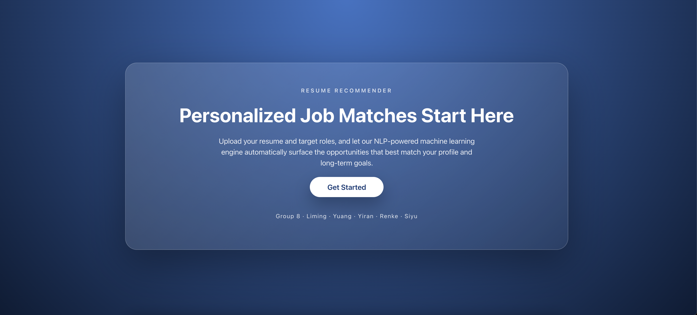
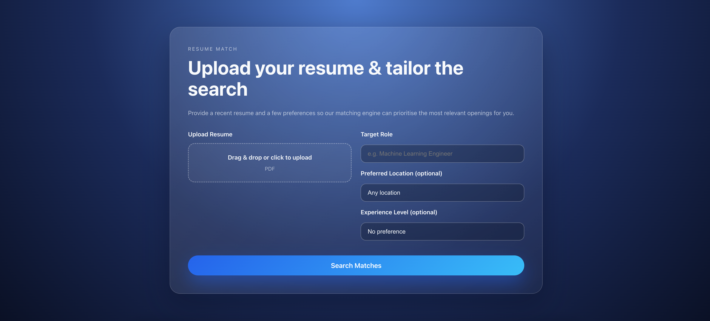

# Job Recommendation System

**Team:** Liming Ye · Yuang Li · Yiran Tao · Renke Deng · Siyu Hu  
**Public WebSite:** https://huggingface.co/spaces/yl1853/dsan6700_group8   
**Documentation:** https://leonay07.github.io/resume-recommender/  
**RapidAPI key location:** `backend/.env` (see setup below)

---

## Overview

This project input a user’s PDF/DOCX resume, fetches fresh job listings from RapidAPI’s JSearch feed, and ranks them with a hybrid scoring model (skills overlap, TF–IDF similarity, intent, experience, location). The stack comprises:

- **Frontend:** React + Vite + TypeScript with routed pages (Landing, Search, Result, Job Detail). API endpoints are configurable via `VITE_API_BASE_URL`.
- **Backend:** FastAPI service handling file uploads, resume parsing (pdfplumber + python-docx), RapidAPI calls, hybrid recommender, caching for “Load More,” and optional MLflow experiment logging.
- **Infrastructure:** Docker Compose spins up independent frontend, backend, and MLflow services while the root `Dockerfile` packages a single container (used on Hugging Face Spaces).
- **Tooling:** MkDocs documentation, pytest suite, Ruff linting, and GitHub Actions CI (`.github/workflows/ci.yml`) that runs lint + tests on every push/PR.

### System Architecture
`TODO – insert architecture diagram path or image`

---

## Quickstart

Pick whichever workflow you need. Both require a RapidAPI JSearch key stored in `backend/.env`. If this file does not exist, please create it manually before starting the services.

### Configure RapidAPI Key
```
RAPID_API_KEY=YOUR_KEY
RAPID_API_HOST=jsearch.p.rapidapi.com
```
This file is ignored by Git—update it whenever you rotate credentials.


### Option A – Docker Compose

```bash
docker compose up --build
```

Once started, the following services will be available:

| Service  | URL               | Notes                                  |
|----------|-------------------|----------------------------------------|
| frontend | http://localhost:5173 | Vite build served via `serve`.           |
| backend  | http://localhost:8000 | FastAPI API + static assets.            |
| mlflow   | http://localhost:5500 | Tracks metrics when `MLFLOW_TRACKING_URI` is set. |

Note: This project is primarily accessed via the frontend UI.
Please open the frontend URL to explore and interact with the application.

To stop and clean up all containers:

```bash
docker compose down

```

### Option B – Local Development

Run the project locally using a standard backend + frontend setup.

#### 1. Install dependencies

This script sets up the Python environment (Poetry) and installs frontend dependencies.

```bash
chmod +x setup_local.sh
./setup_local.sh
```

#### 2. Start the backend (FastAPI)

Run the API server with hot reload enabled.

```bash
poetry run uvicorn backend.app:app --reload --port 8000
```

Once started, it will be available at:  
http://127.0.0.1:8000

Note: This service is used only to run the backend logic and does not display a UI.  
Please proceed to start the frontend and view the application in the frontend preview window.

#### 3. Start the frontend 

In a new terminal, start the frontend development server and point it to the local backend.

```bash
cd frontend
npm run dev
```

The UI will be served at:  
http://127.0.0.1:5173

---

## Testing & CI

- Unit tests: `poetry run pytest`
- Linting: `poetry run ruff check .`
- GitHub Actions CI (`.github/workflows/ci.yml`) runs lint + pytest on push/PR.

---

## Experiment Tracking

- `backend/nlp_model_stub.py` logs query metadata and score metrics to MLflow over the REST API whenever `MLFLOW_TRACKING_URI` is provided (enabled automatically in Compose).
- Artifacts are stored in `./mlruns/` (ignored in Git). Hugging Face deployment omits MLflow by default unless you wire an external tracking URI.

---

## Repository Map

| Path | Description |
|------|-------------|
| `backend/` | FastAPI app, resume parser, NLP modules, job fetcher. |
| `frontend/` | React/Vite client with components, pages, styles, API helper. |
| `docs/` | MkDocs site (architecture, API, deployment). |
| `tests/` | Pytest cases for resume parser and recommender logic. |
| `docker-compose.yml` | Multi-service stack (frontend/back/MLflow). |
| `Dockerfile` | Single container build (used for Hugging Face). |
| `.github/workflows/ci.yml` | CI pipeline (ruff + pytest). |
| `discussion.pdf` | Final analysis report. |

---

## Application Preview

### Landing Page



### Home Page


### Search Page



### Results Page


